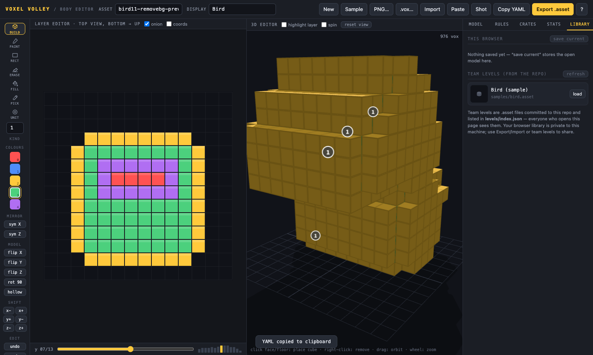

# Voxel Volley — Body Editor

A free, static, web-based level editor for **Voxel Volley** `VoxelBody` assets.
Designers build voxel models cube-by-cube in 3D (or layer-by-layer from the
bottom up), set up the crate economy, and export a Unity `.asset` file that
drops straight into the project — the exporter reproduces the Unity YAML
format **byte-for-byte** (verified against a real asset round-trip).

Everything runs in the browser. No accounts, no server, no build step, no
paid services: host it on GitHub Pages for free.



## Quick start (hosting on GitHub Pages)

1. Create a GitHub repository and push this folder to it:

   ```bash
   cd voxel-body-editor
   git init -b main            # if not already a repo
   git add -A && git commit -m "Voxel body editor"
   git remote add origin https://github.com/<you>/voxel-body-editor.git
   git push -u origin main
   ```

2. In the repo: **Settings → Pages → Source: Deploy from a branch**,
   branch `main`, folder `/ (root)`. Save.

3. After a minute the editor is live at
   `https://<you>.github.io/voxel-body-editor/`. Share that URL with the team.

> Local development: ES modules need an HTTP server (not `file://`).
> Run `python3 -m http.server` in the repo folder and open
> `http://localhost:8000`.

## Team workflow (2–3 people, all free)

- **Designers** open the Pages URL, build models, and click **Export .asset**.
- The exported file goes into the Unity project's `Assets/` folder next to the
  existing VoxelBody assets, then into the levels list. Unity generates the
  `.meta`; the asset already carries the right script GUID.
- **Shared levels:** commit `.asset` files into this repo (e.g. under
  `levels/`) and list them in [`levels/index.json`](levels/index.json):

  ```json
  [
    { "name": "Bird (sample)", "path": "samples/bird.asset" },
    { "name": "Rocket v2",     "path": "levels/rocket_v2.asset" }
  ]
  ```

  Everyone then sees them in the editor's **Library → Team levels** tab and
  can load them with one click. Git is the source of truth and the review
  trail.
- Each browser also keeps a private **library** (IndexedDB) with thumbnails,
  and **autosaves** the open model continuously, so a closed tab or crash
  loses nothing.

## Features

| Area | What you get |
|---|---|
| 3D editing | Click a face (or the floor grid) to place a cube, right-click to remove; ghost preview; orbit/pan/zoom camera; auto-spin; per-layer highlighting; PNG screenshots |
| Layer editing | Top-down slices from bottom → up, onion skin, occupancy strip, coordinates overlay |
| Tools | Build, paint, rectangle, erase, flood fill (2D area / 3D connected region), colour picker, unit placement; mirror-X / mirror-Z symmetry |
| Model ops | Flip X/Y/Z, rotate 90°, shift on any axis, hollow (remove enclosed interior), resize grid with centering, undo/redo (200 steps) |
| Import | Unity `.asset` (file or pasted YAML), MagicaVoxel `.vox` (colours mapped to the 5 game colours), PNG voxelizer approximating the Unity pipeline |
| Export | Unity `.asset` byte-identical format, robust download fallbacks, copy-as-YAML, PNG screenshot |
| Level design | Layer rules, unit rules, full crate-cell/refill economy editor with auto-fill, ammo-vs-voxel balance stats, validation warnings (completability, unit mismatches, disconnected islands) |
| Comfort | Keyboard shortcuts (press `?`), editable display palette, autosave, model library with thumbnails, shared team levels |

## Editing the format

`js/asset.js` is the single place that reads/writes the Unity YAML. The
exporter mirrors the exact field order of assets produced by the Unity tool.
If `VoxelBody.cs` gains fields, extend `parseAsset`/`exportAsset` together and
re-verify a round-trip (import a Unity-made asset, export, `diff`).

Grid layout: the `colours`/`units` hex strings encode a `size³` cube, two hex
chars per cell (`ff` = empty, `00–04` = colour index), ordered x, then y
(downward), then z. `depth` is only the voxelizer parameter stored on the
asset. The script GUID is editable under **Model → Unity wiring**.

## Tech

Plain ES modules — no framework, no bundler, nothing to install. Three.js
(vendored in `vendor/`, MIT) renders the 3D view with an instanced mesh and
raycast picking. State lives in one module with an event bus; every mutation
goes through it, so undo/autosave/views can't drift apart.

```
index.html          app shell + import map
css/style.css
js/state.js         state, undo, events, (de)serialization
js/asset.js         Unity .asset YAML read/write (format-critical)
js/tools.js         all edit operations + symmetry + transforms
js/editor3d.js      Three.js 3D editor
js/slice.js         layer editor
js/palette.js       display palette (localStorage)
js/voxelize.js      PNG → voxels
js/vox.js           MagicaVoxel .vox import
js/library.js       IndexedDB library + autosave + team levels
js/crates.js        crate economy UI
js/stats.js         balance stats + validation
js/ui.js            toasts, modals, download/clipboard fallbacks
js/main.js          wiring/boot
```

## License

MIT (see [LICENSE](LICENSE)). Three.js is MIT (see `vendor/THREE-LICENSE`).
